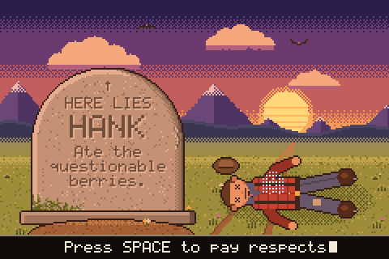
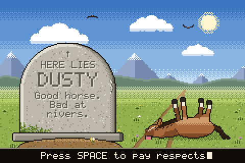
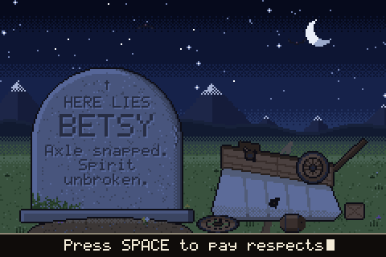
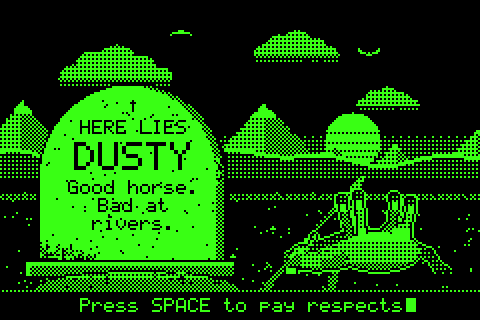

# Trail Tombstone

A retro pixel-art tombstone GIF generator. Pick who didn't make it (a fallen traveler, a dead horse, or a tipped-over covered wagon), carve your own epitaph, and export an animated, looping GIF.

| Traveler (sundown) | Horse (midday) | Wagon (moonlight) | Green screen |
| --- | --- | --- | --- |
|  |  |  |  |

All the art is original and drawn procedurally in code. There are no image assets and no dependencies, just Node 18+ (or any modern browser).

## Use it

**In a browser:** open `dist/index.html`. Pick a subject and sky, edit the text, hit **Make GIF**, then **Save GIF**. Your settings are remembered in that browser.

- **Colors → Green screen** draws the whole scene in just two colors, black and neon green, using dither patterns for the in-between shades.
- **Typewriter text** spells out the epitaph and then the caption one letter at a time, holds on the finished stone, and loops. The GIF runs about 6 seconds instead of 2.
- **Reshuffle scenery** rerolls the mountains, grass tufts and flowers.

**From the command line:**

```bash
node cli.js --subject horse --name "Dusty" --epitaph "Good horse. Bad at rivers." -o dusty.gif
node cli.js --subject wagon --sky night --typewriter --scale 4 -o wagon.gif
node cli.js --subject traveler --green -o hank-green.gif
node cli.js --help
```

| Option | What it does |
| --- | --- |
| `--subject` | `traveler`, `horse` or `wagon` |
| `--sky` | `day`, `dusk` or `night` |
| `--look` | `color` (default) or `green` for black and neon green only; `--green` is a shorthand |
| `--header` | small line at the top of the stone (default `HERE LIES`) |
| `--name` | carved large if it's 5 characters or fewer, otherwise normal size |
| `--epitaph` | wraps to fit the stone's curve; `\n` forces a line break |
| `--caption` | text in the black bar along the bottom; `--caption ""` hides the bar |
| `--scale` | pixel multiplier 1–8 (3 = 720×480) |
| `--delay` | frame delay in hundredths of a second (default 9) |
| `--seed` | changes the mountains, grass and flowers |
| `--typewriter` | types the epitaph and caption out letter by letter |
| `--no-cross`, `--no-flowers`, `--no-buzzards`, `--no-critters` | turn extras off (critters = the ghost, the flies, or the wagon's spinning front wheel) |

**As a library:**

```js
const TT = require('./src/scene');
const { bytes } = TT.renderGif({ subject: 'traveler', name: 'Ezra', epitaph: 'Said "I know a shortcut."' });
require('fs').writeFileSync('ezra.gif', bytes);
```

## Develop

```bash
npm run build     # inline src/ + web/ into dist/index.html (and dist/artifact.html)
npm test          # encoder round-trip, pixel-exact frame decode, layout, CLI
npm run examples  # re-render the GIFs in examples/
```

| File | Role |
| --- | --- |
| `src/gif.js` | GIF89a encoder: LZW compression, looping, integer upscaling, and frame differencing (after the first frame only the changed rectangle is stored, so GIFs stay around 30–60 KB) |
| `src/font.js` | 5×7 bitmap font with word wrap that follows the stone's rounded top |
| `src/art.js` | palette (re-tinted per time of day, plus the green-screen brightness levels), drawing primitives, and all the sprites and scenery |
| `src/scene.js` | public API: text layout on the headstone, frame composition, `renderFrames` / `renderGif` |
| `web/` | the browser UI (template + app script) |
| `scripts/build.js` | single-file build, no bundler |
| `cli.js` | command-line front end |
| `test/` | tests plus a small independent GIF decoder used to verify the encoder |

Rendering happens at 240×160 logical pixels with a fixed indexed palette, so frames go straight to the GIF encoder with no color quantization. Every frame is upscaled with nearest-neighbour sampling to keep the pixels crisp.
